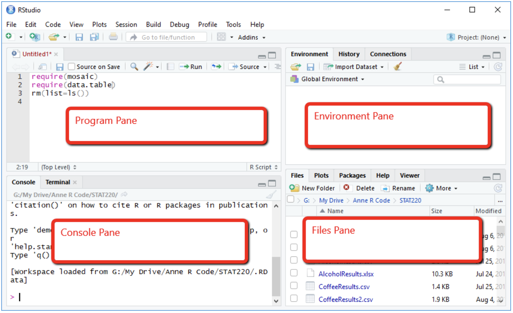
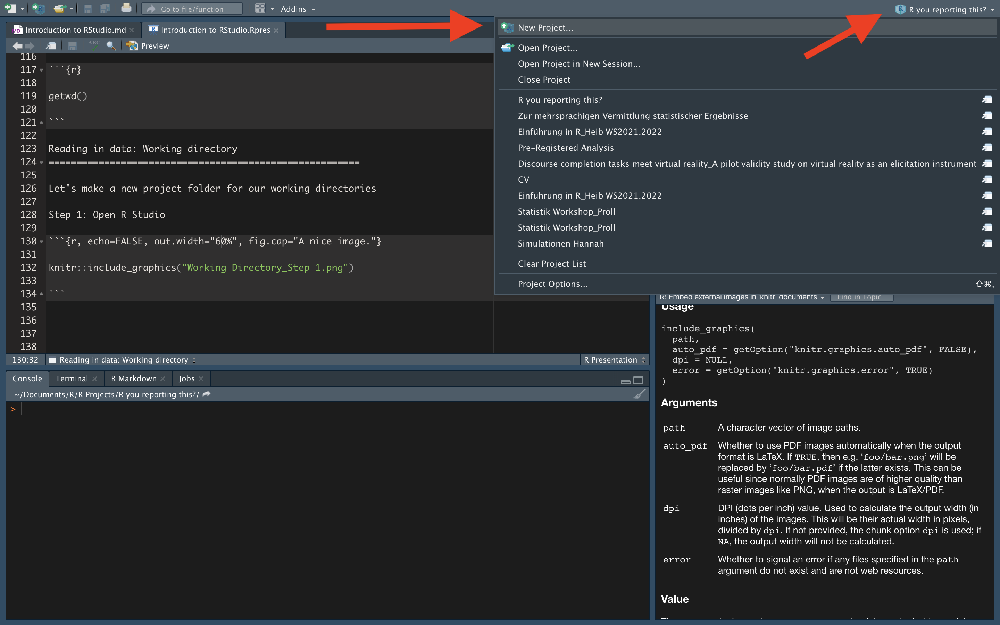
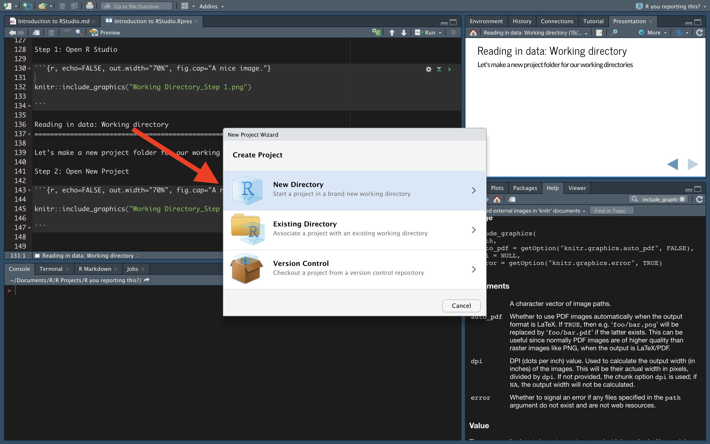
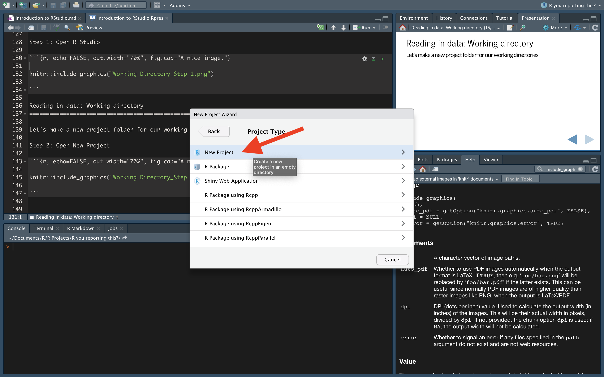
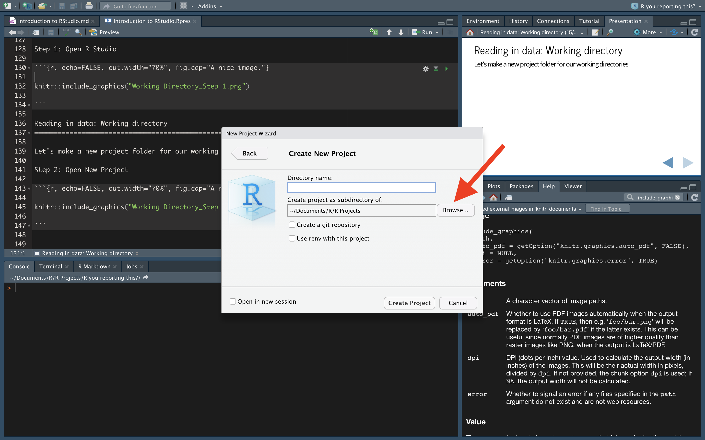
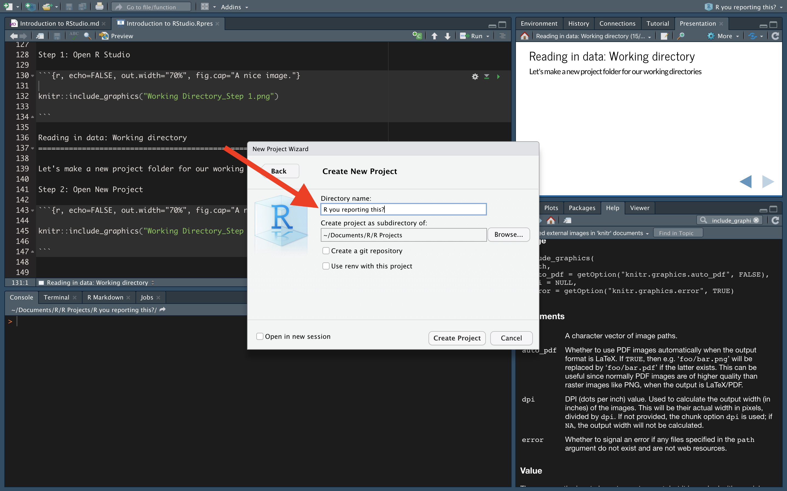

## Presentation

### What is this workshop about?

- Introduction to RStudio
- Introduction to RMarkdown for open data and reproducibility
- Set up file management systems with R
- Keep your code tidy and readable 

### Topics 

- Basic coding in RStudio (we will largely use the Tidyverse) 
- Types of variables (vectors, factors, data frames)
- Importing data
- Setting up an R Markdown document
- Ensuring reproducible and understandable code
- Structuring an R project (folders, files, project management etc.)
- Using OSF (Open Science Framework) to store data

### Rationale

In disciplines such as psychology, the problem of **replicability** has migrated to the forefront of discussions, and large-scale replication attempts have produced largely disheartening results. 

However, these **replication failures have inspired rich discussions about methodological and practical standards**, including in the field of linguistics. Reforms proposed in reaction to the so-called ‘**replication crisis**’ have recommended improving the quality of empirical evidence via e.g. pre-registrations, registered reports and, of course, **open data**. 

The guiding idea behind **open data is to make it easier to verify published results**, and this includes making the raw data available as well as the analysis procedures in their entirety (**e.g. by providing the necessary R or Python scripts**). 

### Resources

When you can't figure something out (and this will happen), your first steps should be to look at: 

- [Google](google.com)
- [stackoverflow](https://stackoverflow.com) 

Chances are, someone will have had the same problem and someone smarter than us will have solved the problem. 

### Literature 

I can recommend the following works: 

- [Learning R](http://duhi23.github.io/Analisis-de-datos/Cotton.pdf)
- [R Cookbook, 2nd edition](https://rc2e.com)
- [Getting started with RStudio](https://rafalab.github.io/dsbook/getting-started.html)
- [R Graphics Cookbook, 2nd edition](https://r-graphics.org)
- [R for Data Science](https://r4ds.had.co.nz)

### Getting to know RStudio: The Panes




### The Source Editor

`Source Editor` (upper left): 

The source editor is good for opening, editing and executing different programs, codes etc. and lets you store your code in a neat fashion.

### The Console

`Console` (lower left): 

Here, one can run code immediately, but the code is not stored. Good for tying and testing things out before actually using and storing the code in the source editor. 

### Environment and History Panes

`Environment and History panes` (upper right): 

The environment pane is very useful in Rstudio, as it directly shows you which data frame are stored, which variables, arrays, functions etc. You can also click on a stored vector or data frame or even variable using the environment pane and open it directly in Rstudio. You are then able to look at it like a normal table. The history pane lets you go back through your execution history and see which lines of code and functions you previously executed. 

### Files, Plots, Packages etc. Panes

`Files, Plots, Packages, Help, and Viewer panes` (lower right): 

In these panes, you can load in files, plots, packages, find help (which is also possible via the commands `?` or `??`) etc. 

### Working directory

What is a `working directory`? 

The Working Directory is the place where R puts files that you SAVE
    
AND

The Working Directory is the place where R puts files that you READ IN

How do I find out where my working directory is?

```{r}

getwd()

```

Let's make a new project folder for our working directories 

Pre-steps 1: 

Open your finder window, create a folder `R`. 
    
Pre-steps 2: 
    
In the folder `R` we created, create a folder `R Projects`. 

Step 1: Open R Studio


Step 2: Open New Project



Step 3: Click on `New Directory`



Step 4: Click on `New Project`



Step 5: Browse your folders, set your working directory in the R folder we made earlier. 



Step 6: Name `Directory name` **R you reporting this?**. 



### Reading in the data

We can read in data a few different ways. 

1. the `read.csv` function from `base R` 

```{r}

Vampires = read.csv("Vampires.csv")

```

OR

```{r}

Vampires = read.csv("./Vampires.csv")

```

We can also read in data via the `Files` pane

```{r} 

head(Vampires)

```
